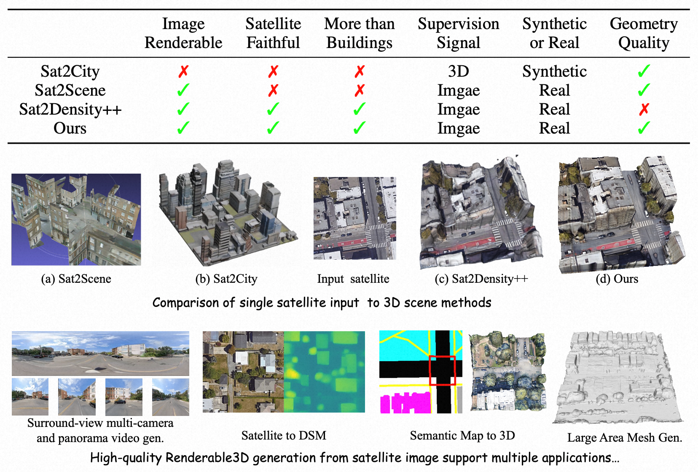

# Sat3DGen
### [ICLR 2026] Sat3DGen: Comprehensive Street-Level 3D Scene Generation from Single Satellite Image

[](https://arxiv.org/abs/2605.14984)
[](https://openreview.net/forum?id=E7JzkZCofa)
[](https://qianmingduowan.github.io/Sat3DGen_project_page/)
[](https://huggingface.co/qian43/Sat3DGen)
[](https://huggingface.co/datasets/qian43/VIGOR_SAT3DGEN_add_skymask_DSM_satdepth)
[](https://huggingface.co/spaces/qian43/Sat3DGen)
[](https://modelscope.cn/models/xasDsacxsax/Sat3DGen)
[](LICENSE)

[Ming Qian](https://qianmingduowan.github.io/), [Zimin Xia](https://ziminxia.github.io/), [Changkun Liu](https://lck666666.github.io), [Shuailei Ma](https://scholar.google.com/citations?user=dNhzCu4AAAAJ&hl=zh-CN), [Wen Wang](https://encounter1997.github.io/), [Zeran Ke](https://calmke.github.io/), [Bin Tan](https://icetttb.github.io/), [Hang Zhang](https://openreview.net/profile?id=~Hang_Zhang22), [Gui-Song Xia](http://www.captain-whu.com/xia_En.html)

<p align="center">

https://github.com/user-attachments/assets/4efaf089-9cdc-4663-ab2a-1ac128d44454

</p>

---

⭐ **If you find this work interesting or useful, please give us a star!** It helps others discover the project and motivates us to keep improving it.

## 📢 News
* **[May 15, 2025]** 🎉 ArXiv paper is now publicly available! [ArXiv](https://arxiv.org/abs/2605.14984).
* **[Apr 27, 2025]** 🎉 Code, data, and model weights are now publicly available! [Online demo](https://huggingface.co/spaces/qian43/Sat3DGen) is live on HuggingFace Spaces.
* **[Jan 29, 2025]** Repository initialized.

---

## Abstract
Generating a street-level 3D scene from a single satellite image is a crucial yet challenging task. Current methods present a stark trade-off: geometry-colorization models achieve high geometric fidelity but are typically building-focused and lack semantic diversity. In contrast, proxy-based models use feed-forward image-to-3D frameworks to generate holistic scenes by jointly learning geometry and texture, a process that yields rich content but coarse and unstable geometry. 

We introduce **Sat3DGen** to address these fundamental challenges, embodying a **geometry-first methodology**. This methodology enhances the feed-forward paradigm by integrating novel geometric constraints with a perspective-view training strategy, explicitly countering the primary sources of geometric error. This geometry-centric strategy yields a dramatic leap in both 3D accuracy and photorealism. We demonstrate the versatility of our high-quality 3D assets through diverse downstream applications, including semantic-map-to-3D synthesis, multi-camera video generation, large-scale meshing, and unsupervised single-image Digital Surface Model (DSM) estimation.

---

<p align="center">
  
</p>

## 📝 About This Release

This repository contains the public release of **Sat3DGen**, including:

- training
- single-image inference
- large-image slicing inference
- DSM export and DSM evaluation
- DSM preparation and alignment utilities

## 🎮 Online Demo

Try Sat3DGen directly in your browser on HuggingFace Spaces (no installation needed):

🤗 **[https://huggingface.co/spaces/qian43/Sat3DGen](https://huggingface.co/spaces/qian43/Sat3DGen)**

> **Note:** The online demo runs on CPU and may be slow. For faster inference, we recommend [deploying locally with a GPU](#-gradio-web-demo).

## 📚 Documentation

For different parts of the release, please refer to:

- training: [docs/training.md](docs/training.md)
- inference: [docs/inference.md](docs/inference.md)
- evaluation: [docs/evaluation.md](docs/evaluation.md)
- dataset layout: [docs/dataset_layout.md](docs/dataset_layout.md)
- released config notes: [docs/config_notes.md](docs/config_notes.md)

## 🔧 Installation

The released training, inference, and checkpoint-based evaluation paths assume a CUDA-enabled environment.

### 1. Create Environment

```bash
conda create -n sat3dgen python=3.10
conda activate sat3dgen
```

### 2. Install PyTorch

Please install a PyTorch version that matches your CUDA environment.

Example:

```bash
conda install pytorch torchvision torchaudio pytorch-cuda=12.4 -c pytorch -c nvidia
```

### 3. Install Dependencies

```bash
pip install -r requirements.txt
```

### 4. Model Weights

Our model is hosted on **HuggingFace** — no manual download required:

🤗 **[https://huggingface.co/qian43/Sat3DGen](https://huggingface.co/qian43/Sat3DGen)**

All inference scripts default to loading from HuggingFace automatically.
The first run downloads the weights (~1.5 GB) and caches them under
`~/.cache/huggingface/hub/`. Subsequent runs load instantly from cache.

**Quick test** (no local checkpoints needed):

```python
from source.generator import Sat3DGen

Sat3DGen._skip_backbone_weights = True
model = Sat3DGen.from_pretrained("qian43/Sat3DGen")
model = model.to("cuda:0").eval()
```

<details>
<summary>Alternative: use local checkpoints or ModelScope</summary>

You can also download the weights manually and place them under `./checkpoints/`:

```text
checkpoints/
├── config.json
└── diffusion_pytorch_model.safetensors
```

Pass `--model_path checkpoints` to the inference scripts to use local weights.

Weights are also available on **ModelScope**:
[https://modelscope.cn/models/xasDsacxsax/Sat3DGen](https://modelscope.cn/models/xasDsacxsax/Sat3DGen)

</details>

<details>
<summary>DINOv3 backbone (only needed for training)</summary>

For **inference**, DINOv3 backbone weights are already bundled in the released
checkpoint — no extra download needed.

For **training**, the DINOv3 backbone weights are loaded separately. The
default backbone is `facebook/dinov3-vitl16-pretrain-sat493m`.

**Download**: request access and download from HuggingFace:
[facebook/dinov3-vitl16-pretrain-sat493m](https://huggingface.co/facebook/dinov3-vitl16-pretrain-sat493m)

The code looks up weights in this order:

1. Environment variable `SAT3DGEN_DINOV3_SAT_PATH` (or `SAT3DGEN_DINOV3_LVD_PATH`).
2. Local Hugging Face cache: `~/.cache/huggingface/hub/...`
3. Hugging Face Hub: `facebook/dinov3-vitl16-pretrain-sat493m`.

If you have HuggingFace access, the first training run downloads it
automatically. Otherwise, download manually and set the environment variable:

```bash
export SAT3DGEN_DINOV3_SAT_PATH=/path/to/your/dinov3-vitl16-pretrain-sat493m
```

</details>

## 📦 Dataset Preparation

Our experiments in the released code are based on [**VIGOR**](https://github.com/Jeff-Zilence/VIGOR). Please download the original VIGOR dataset first.

The original VIGOR release provides the satellite and panorama RGB images. We release the project-specific supplements on HuggingFace (available now):

🤗 **[https://huggingface.co/datasets/qian43/VIGOR_SAT3DGEN_add_skymask_DSM_satdepth](https://huggingface.co/datasets/qian43/VIGOR_SAT3DGEN_add_skymask_DSM_satdepth)**

The supplement includes:

- `sat_depth/`
- `pano_sky_mask/`
- `Seattle_DSM/`
- training split `.txt` files
- test split `.txt` files

Important note:

- `Seattle_DSM/` should be placed at the same level as the city folders such as `Seattle/`, not inside `Seattle/`.

For the expected folder organization, please see [docs/dataset_layout.md](docs/dataset_layout.md).


## 🌐 Gradio Web Demo

We provide an interactive **Gradio** web demo for users who prefer a graphical
interface (no command line, no notebook required):

```bash
python app.py
```

Then open `http://localhost:7860` in your browser.

The web demo provides two tabs:

- **3D Mesh Generation**: upload a satellite image and download the
  reconstructed `.obj` mesh, with an in-browser 3D preview.
- **Video Rendering**: select or upload a satellite image and a sky
  panorama, then render a walkthrough video along a pre-generated trajectory.

Optional environment variables:

- `GRADIO_SERVER_PORT` — change the listening port (default: `7860`).

## 🚀 Command-Line Demo

After installing dependencies and downloading the checkpoint, you can run the
end-to-end demo on a single satellite image:

```bash
bash inference.sh data/vigor/Seattle/satellite/<your_image>.png 0
```

The script will:

1. Generate a 3D triplane representation and export a textured mesh.
2. If no trajectory is found at
   `results/demo/<image_stem>/trajectory.csv`, it will pause and ask you to
   draw one interactively in `inference/make_trajectory.ipynb`
   (open it in VSCode and run all cells; first time install with
   `pip install ipympl`).
3. Render panorama + 4-direction perspective views along the trajectory.
4. Render a 3D mesh orbit video.
5. Compose a final demo video.

Outputs are saved under `results/demo/<image_stem>/`:

```text
input_sat.png            # input satellite image
trajectory.csv           # trajectory used for rendering
trajectory.png           # trajectory visualization
mesh.obj                 # extracted 3D mesh
trajectory_video.mp4     # satellite + moving camera marker
mesh_orbit_video.mp4     # orbiting view of the 3D mesh
panorama_video.mp4       # panorama rendering along trajectory
streetview_video.mp4     # 4 perspective views along trajectory
demo_video.mp4           # composed final video
```

For more inference options (single-image inference, large-image slicing,
DSM visualization, etc.), see [docs/inference.md](docs/inference.md).

## 📂 Code Structure

```text
Sat3DGen_clean/
├── configs/
│   └── dino_v3_large_sat_0906.json
├── demo_train.sh
├── train.py
├── app.py                          # interactive Gradio web demo
├── inference.sh                    # one-click end-to-end CLI demo
├── inference/
│   ├── demo_inference.py           # demo pipeline
│   ├── make_trajectory.py          # CLI trajectory tool (needs display)
│   ├── make_trajectory.ipynb       # notebook trajectory tool (no display)
│   ├── single_image_inference.py
│   ├── big_image_slice_inference.py
│   ├── evaluate_img_metrics.py
│   └── visualize_dsm.py
├── DSM_processing/
│   ├── calculate_DSM_metric2.py
│   └── processing_DSM_pair_from_txt.py
├── metrics/
├── my_datasets/
├── requirements.txt
├── src/
├── source/
├── docs/
│   ├── config_notes.md
│   ├── dataset_layout.md
│   ├── evaluation.md
│   ├── inference.md
│   └── training.md
├── LICENSE
└── CONTRIBUTING.md
```

## 📌 Notes

- This public release does **not** ship a `data/vigor` directory. Users should prepare their own [VIGOR](https://github.com/Jeff-Zilence/VIGOR) root.
- Model weights are released on [HuggingFace](https://huggingface.co/qian43/Sat3DGen) and [ModelScope](https://modelscope.cn/models/xasDsacxsax/Sat3DGen); VIGOR supplements are available on [HuggingFace Datasets](https://huggingface.co/datasets/qian43/VIGOR_SAT3DGEN_add_skymask_DSM_satdepth).
- The current evaluation pipeline does **not** include the DINO metric.

## 🤝 Contributing

We welcome contributions of any kind — bug fixes, new features, documentation
improvements, and benchmark extensions. See [CONTRIBUTING.md](CONTRIBUTING.md)
for details.

## 📄 License

This project is released under the [MIT License](LICENSE).

## 📜 Citation

If our work helps your research, please cite:

```bibtex
@inproceedings{
    qian2026satdgen,
    title={Sat3{DG}en: Comprehensive Street-Level 3D Scene Generation from Single Satellite Image},
    author={Ming Qian and Zimin Xia and Changkun Liu and Shuailei Ma and Wen Wang and Zeran Ke and Bin Tan and Hang Zhang and Gui-Song Xia},
    booktitle={The Fourteenth International Conference on Learning Representations},
    year={2026},
    url={https://openreview.net/forum?id=E7JzkZCofa}
}

@ARTICLE{Qian_2026_Sat2Densitypp,
    author={Qian, Ming and Tan, Bin and Wang, Qiuyu and Zheng, Xianwei and Xiong, Hanjiang and Xia, Gui-Song and Shen, Yujun and Xue, Nan},
    journal={IEEE Transactions on Pattern Analysis and Machine Intelligence}, 
    title={Seeing Through Satellite Images at Street Views}, 
    year={2026},
    volume={48},
    number={5},
    pages={5692-5709},
    doi={10.1109/TPAMI.2026.3652860}}

@InProceedings{Qian_2023_Sat2Density,
    author    = {Qian, Ming and Xiong, Jincheng and Xia, Gui-Song and Xue, Nan},
    title     = {Sat2Density: Faithful Density Learning from Satellite-Ground Image Pairs},
    booktitle = {Proceedings of the IEEE/CVF International Conference on Computer Vision (ICCV)},
    month     = {October},
    year      = {2023},
    pages     = {3683-3692}
}


```

## 🙏 Acknowledgements

This work builds on a number of excellent projects and prior efforts, including:

- [Sat2Density](https://github.com/qianmingduowan/Sat2Density)
- [Sat2Density++](https://github.com/qianmingduowan/Sat2Densitypp)
- [EG3D](https://github.com/NVlabs/eg3d)
- [DINOv3](https://github.com/facebookresearch/dinov3)
- [PyTorch](https://pytorch.org/)
- [Diffusers](https://github.com/huggingface/diffusers)

We also thank our collaborators and colleagues for their discussions and feedback during the project.
